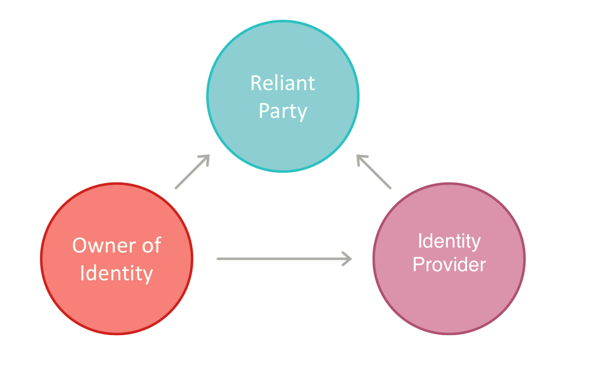

## Introduction
Built on top of OpenID and focused on customer privacy, this ***Digital Trust Protocol*** is a proposal for a new standard for verified data sharing services.
Sharing data occurs in many every day activities, when people and businesses interacts with third parties to benefit from many services they currently
offer.
By establishing a way to securely and trustily connecting identity owners, relying parties and identity providers, our aim is to simplify those interactions.
