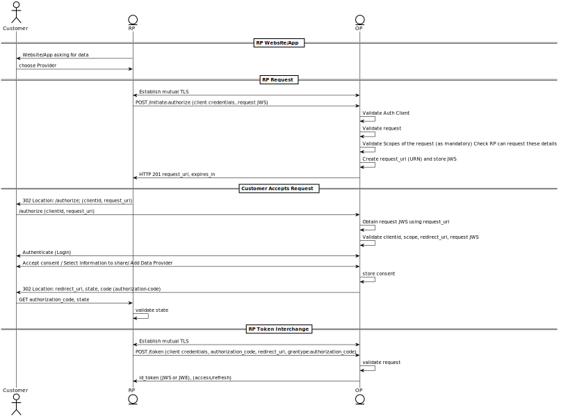

## Authorization Code Flow
Below you can see one of the flows we are working on as part of the protocol, in this case it refers to the one on top of OpenId Authorization Code. For more details about this specification, please follow this [link]((../auth_code/dtp-auth-code-00.html).

In summary, this flow consists in 3 steps:

- RP sends request from backend with claims to be shared or verified. In return, a unique `request_uri` is obtained.
- RP redirects User to OP in the front-end passing the `request_uri`. User will authenticate and authorize (consent) the request, redirecting back to RP passing `authorization code`.
- RP exchanges the `code` with an `id_token`, which contains the response with the claims accepted by the User