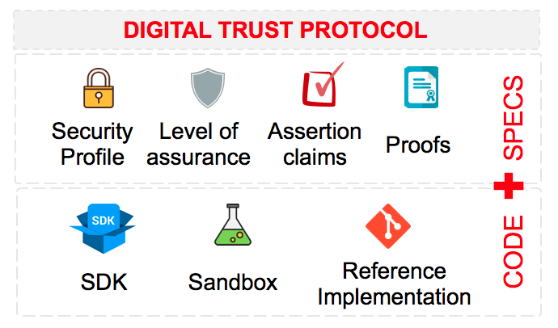

## Welcome

You will be able to find here references to the different specifications we are publishing as part of the protocol, among other assets we are contributing with to help adoption from both Relying Parties and Identity Verification Providers.

If you want to know more about the protocol, please follow this [link](docs/intro).

## Protocol Specifications

When defining Digital Trust Protocol, the first major decision we took was to built on top of OpenID.  
However, we thought that extending existing OpenID specs would be needed to fulfil our requirements, with end-user privacy control, and security best practices as core principles.

### DTP Authorization Code Flow
The core specification for OpenID includes the main elements that will help fully adoption by the industry, however and by design, in order to support many use cases it's a very open specification subject to individual implementations.
That led us to the conclusion that we should create our own profile restricting less secure elements and flows within OpenID Core, but also to produce a set of extensions to cover specific features for identity and verified data sharing.

- Read specifications [here](./auth_code/dtp-auth-code-00.html)
- Contribute to specifications [digital-trust-authorization-code-profile-specs](https://github.com/gruposantander/digital-trust-authorization-code-profile-specs)

### Assertion Claims
In order to provide the information that is needed by the RP, and the same time avoid unnecessary leak of information, the answer to some claims may be only a boolean verifying the claim instead of returning the actual claim.  
By providing a rich syntax for creating such assertions, it will be possible to accommodate a variety of use cases, as far as we also provide sufficient explanation to end user when providing the consent to share the assertion.

- Read specifications [here](./assertions/claim-assertions-00.html)
- Contribute to specifications [digital-trust-assertion-claims-specs](https://github.com/gruposantander/digital-trust-assertion-claims-specs)

### Levels of Assurance
Within current OpenID specifications, when returning claims to the RP, with the exception of email and telephone, there is no a way to declare and differentiate those claims that have been validated by the OP following their current customer due diligence or onboarding processes.  
That is the concept around level of assurance, which has associated some degree of liability based on contractual conditions of the service and the relevant legislation the OP is attached too. For instance, banks currently perform KYC and AML checks as part of onboarding process. In that case, some of the claims provided by the bank, could be tight to a particular level of assurance and trust framework.  
We believe that in the majority of situations, the level of assurance will be enough, and it will not be necessary to disclose any other attribute or evidence document back to the RP.  
With this extension proposal, requested claims by the RP can refer to a desired level of assurance. If the OP can meet that LoA for the claim and the user consents, the data will be included in the response, otherwise the claim will not be returned.

- Read specifications [here](./assurance_levels/assurance-levels-00.html)
- Contribute to specifications [digital-trust-assurance-levels-specs](https://github.com/gruposantander/digital-trust-assurance-levels-specs)

## Sandbox
Check our Santander Labs Sandbox to help you getting started and connect to a live sample OP server. You could also find [Postman Collection](https://www.santanderlabs.io/storage/uploads/2020/04/06/5e8b1df52f595Digital-Trust-Protocol---Sandbox.postman_collection.json) for quick protocol try out. Please visit [Santanderlabs.io](https://www.santanderlabs.io/en/api/iamid) for more details.

## SDKs
coming soon...

## Quick Development Guide
The SDKs abstract you from internal details and help you create client applications to communicate with OP servers implementing our specs. If there is not a valid SDK for you or want to review more in detail who it works, follow this [Quick Development Guide](./docs/quick_development_guide) to help you getting started. 

## Sample Reference Implementation
coming soon...

## Support or Contact

Interested in the specifications and want to know more?. Contact us by email at [digital.trust@santander.co.uk](mailto:digital.trust@santander.co.uk) and we’ll help you!

Copyright &copy; 2020 Grupo Santander 
